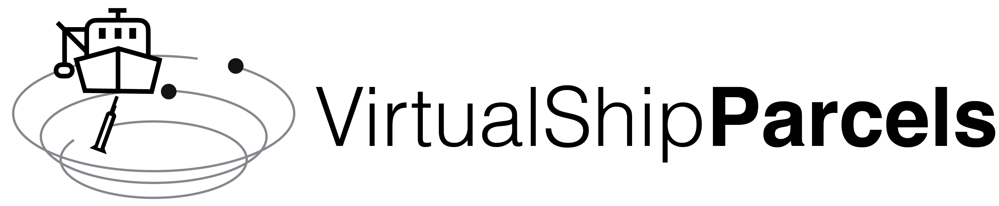

<p align="center">
<picture>
  <source media="(prefers-color-scheme: dark)" srcset="./docs/_static/virtual_ship_logo_inverted.png">
  
</picture>
</p>

<!-- Badges -->

[](https://anaconda.org/conda-forge/virtualship/)

[](https://doi.org/10.5281/zenodo.14013931)
[](https://github.com/OceanParcels/virtualship/actions/workflows/ci.yml)
[](https://codecov.io/gh/OceanParcels/virtualship)

<!-- Zenodo badge -->

---

<!-- SPHINX-START -->
<table>
    <tr>
        <th>Project Owner</th>
        <td>Emma Daniels (e.e.daniels1@uu.nl)</td>
    </tr>
    <tr>
        <!-- Should mirror pyproject.toml. Use one of the "Development status" flags from https://pypi.org/classifiers/-->
        <th>Development status</th>
        <td>Alpha</td>
    </tr>
</table>

<!-- Insert catchy summary -->

VirtualShipParcels is a command line simulator allowing students to plan and conduct a virtual research expedition, receiving measurements as if they were coming from actual oceanographic instruments including:

- ADCP (currents)
- CTD (conductivity and temperature)
- XBT (temperature)
- underwater measurements (salinity and temperature)
- surface drifters
- argo float deployments

<!-- TODO: future. Along the way students will encounter difficulties such as: -->

## Installation

For a normal installation do:

```bash
conda create -n ship -c conda-forge virtualship
conda activate ship
```

which creates an environment named `ship` with the latest version of `virtualship`. You can replace `ship` with any name you like.

For a development installation, please follow the instructions detailed in the [contributing page](https://virtualship.oceanparcels.org/en/latest/contributing.html).

## Usage

```console
$ virtualship --help
Usage: virtualship [OPTIONS] COMMAND [ARGS]...

Options:
  --version  Show the version and exit.
  --help  Show this message and exit.

Commands:
  fetch  Download the relevant data specified in an expedition directory...
  init   Initialize a directory for a new expedition, with an example...
  run    Do the expedition.
```

```console
$ virtualship init --help
Usage: virtualship init [OPTIONS] PATH

  Initialize a directory for a new expedition, with an example configuration.

Options:
  --help  Show this message and exit.
```

```console

$ virtualship fetch --help
Usage: virtualship fetch [OPTIONS] PATH

  Download the relevant data specified in an expedition directory (i.e., by
  the expedition config).

Options:
  --help  Show this message and exit.
```

```console
$ virtualship run --help
Usage: virtualship run [OPTIONS] PATH

  Do the expedition.

Options:
  --help  Show this message and exit.

```

For examples, see [the tutorials section of our documentation](https://virtualship.oceanparcels.org/en/latest/tutorials/index.html).

## Input data

The scripts are written to work with [A-grid ocean data from the Copernicus Marine Service](https://data.marine.copernicus.eu/product/GLOBAL_ANALYSISFORECAST_PHY_001_024/description).

## Source code

The code for this project is [hosted on GitHub](https://github.com/OceanParcels/virtualship).
