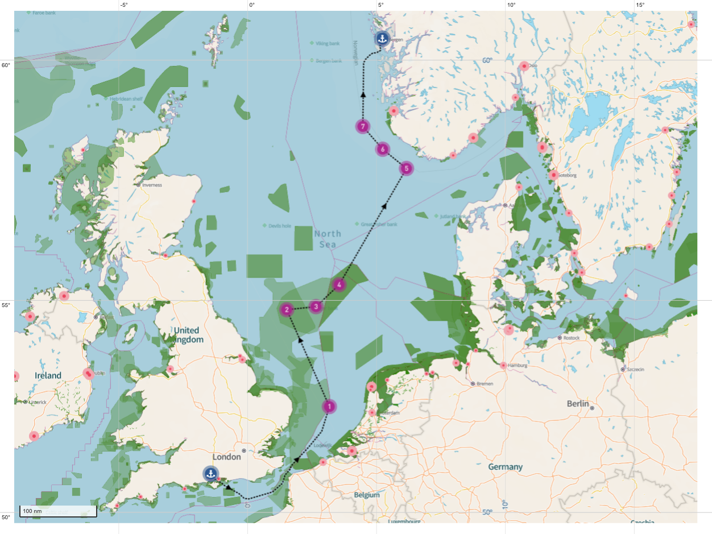
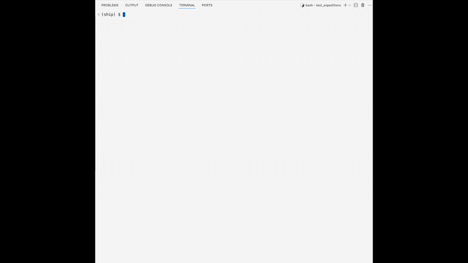
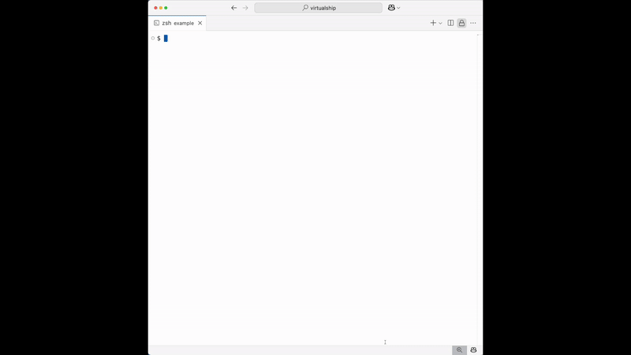

# VirtualShip Quickstart Guide 🚢

Welcome to this Quickstart to using VirtualShip. In this guide we will conduct a virtual expedition in the North Sea. Note, however, that you can plan your own expedition anywhere in the global ocean and conduct whatever set of measurements you wish!

This Quickstart is available as an instructional video below, or you can continue with the step-by-step guide.

<iframe width="560" height="315" src="https://www.youtube.com/embed/ypafzoTBj_A?si=m8BpYN_08OJ9aagq" title="YouTube video player" frameborder="0" allow="accelerometer; autoplay; clipboard-write; encrypted-media; gyroscope; picture-in-picture; web-share" referrerpolicy="strict-origin-when-cross-origin" allowfullscreen></iframe>

---

This guide is intended to give a basic overview of how to plan, initialise and execute a virtual expedition. Data post-processing, analysis and visualisation advice is provided in other sections of the documentation (see [Results](#results) section).

## Expedition route planning

```{note}
This section describes the _custom_ expedition route planning procedure. There is also an option to proceed without your own route and you can instead use an example route, schedule and selection of measurements (see [Expedition initialisation](#expedition-initialisation) for more details).
```

### NIOZ MFP tool

The first step is to plan the expedition route. This can be created with the online [ NIOZ MFP tool](https://nioz.marinefacilitiesplanning.com/cruiselocationplanning#). Documentation on how to use the website can be found [here](https://surfdrive.surf.nl/files/index.php/s/84TFmsAAzcSD56F). Alternatively, you can watch this [video](https://www.youtube.com/watch?v=yIpYX2xCvsM&list=PLE-LzO7kk1gLM74U4PLDh8RywYXmZcloz&ab_channel=VirtualShipClassroom), which runs through how to use the MFP tool.

Below is a screenshot of a North Sea expedition. This example expedition departs from Southampton, UK; conducts measurements at one sampling site in the southern North Sea, three in the Dogger Bank region and a further three around the Norwegian Trench before ending in Bergen, Norway.

Feel free to design your expedition as you wish! There is no need to copy these sampling sites in your own expeditions.



### Export the coordinates

Once you have finalised your MFP expedition route, select "Export" on the right hand side of the window --> "Export Coordinates" --> "DD". This will download your coordinates as an .xlsx (Excel) file, which we will later feed into the VirtualShip protocol to initialise the expedition.

## Expedition initialisation

```{note}
VirtualShip is a command line interface (CLI) based tool. From this point on in the Quickstart we will be working predominantly via the command line in the Terminal. If you are unfamiliar with what a CLI is, see [here](https://www.w3schools.com/whatis/whatis_cli.asp) for more information.
```

You should now navigate to where you would like your expedition to be run on your (virtual) machine (i.e. `cd path/to/expedition/dir/`). Then run the following command in your CLI:

```
virtualship init EXPEDITION_NAME --from-mfp CoordinatesExport.xlsx
```

```{tip}
The `CoordinatesExport.xlsx` in the `virtualship init` command refers to the .xlsx file exported from MFP. Replace the filename with the name of your exported .xlsx file (and make sure to move it from the Downloads to the folder/directory in which you are running the expedition).
```

This will create a folder/directory called `EXPEDITION_NAME` with two files: `schedule.yaml` and `ship_config.yaml` based on the sampling site coordinates that you specified in your MFP export. The `--from-mfp` flag indictates that the exported coordinates will be used.

```{note}
For advanced users: it is also possible to run the expedition initialisation step without an MFP .xlsx export file. In this case you should simply run `virtualship init EXPEDITION_NAME` in the CLI. This will write example `schedule.yaml` and `ship_config.yaml` files in the `EXPEDITION_NAME` folder/directory. These files contain example waypoints, timings and instrument selections, but can be edited or propagated through the rest of the workflow unedited to run a sample expedition.
```

## Expedition scheduling & ship configuration

The next step is to finalise the expedition schedule plan, including setting times and instrument selection choices for each waypoint, as well as configuring the ship (such as its speed and underway measurement instruments). The easiest way to do so is to use the bespoke VirtualShip planning tool via the following command:

```
virtualship plan EXPEDITION_NAME
```

```{tip}
Using the `virtualship plan` tool is optional. Advanced users can also edit the `schedule.yaml` and `ship_config.yaml` files directly if preferred.
```

The planning tool should look something like this and offers an intuitive way to make your selections:



### Ship speed

In the planning tool, under _Ship Config Editor_ > _Ship Speed & Onboard Measurements_, there is an option to change the ship speed. In most cases it is best to leave this as the default 10 knots value.

### Underway measurements

VirtualShip is capable of taking underway temperature and salinity measurements, as well as onboard ADCP measurements, as the ship sails across the length of the expedition (see [here](https://virtualship.readthedocs.io/en/latest/user-guide/assignments/Research_proposal_intro.html#Underway-Data) for more detail). These underway measurements can be switched on/off under _Ship Config Editor_ > _Ship Speed & Onboard Measurements_ as well.

For the underway ADCP, there is a choice of using the 38 kHz OceanObserver or the 300 kHz SeaSeven version (see [here](https://virtualship.readthedocs.io/en/latest/user-guide/assignments/Research_proposal_intro.html#ADCP) for more detail on the two ADCP types).

### Waypoint datetimes

You will need to enter dates and times for each of the sampling stations/waypoints selected in the MFP route planning stage. This can be done under _Schedule Editor_ > _Waypoints & Instrument Selection_ in the planning tool.

Each waypoint has its own sub-panel for parameter inputs (click on it to expand the selection options). Here, the time for each waypoint can be inputted. There is also an option to adjust the latitude/longitude coordinates and you can add or remove waypoints.

```{note}
It is important to ensure that the timings for each station are realistic. There must be enough time for the ship to travel to each site at a realistic speed (~ 10 knots). The expedition schedule (and the ship's configuration) will be automatically verified when you press _Save Changes_ in the planning tool.
```

```{tip}
The MFP route planning tool will give estimated durations of sailing between sites, usually at an assumed 10 knots sailing speed. This can be useful to refer back to when planning the expedition timings and entering these into the `virtualship plan` tool.
```

### Instrument selection

You should now consider which measurements are to be taken at each sampling site, and therefore which instruments need to be selected in the planning tool.

```{tip}
Click [here](https://virtualship.readthedocs.io/en/latest/user-guide/assignments/Research_proposal_intro.html#Measurement-Options) for more information on what measurement options are available, and a brief introduction to each instrument.
```

Instrument selections can be made for each waypoint in the same sub-panels as the [waypoint time](#waypoint-datetimes) selection by simply switching each on or off. Multiple instruments are allowed at each waypoint.

```{note}
For advanced users: you can also make further customisations to behaviours of all instruments under _Ship Config Editor_ > _Instrument Configurations_.
```

### Save changes

When you are happy with your ship configuration and schedule plan, press _Save Changes_.

```{note}
On pressing _Save Changes_ the tool will check the selections are valid (for example that the ship will be able to reach each waypoint in time). If they are, the changes will be saved to the `ship_config.yaml` and `schedule.yaml` files, ready for the next steps. If your selections are invalid you should be provided with information on how to fix them.
```

## Fetch the data

You are now ready to retrieve the input data required for simulating your virtual expedition from the [Copernicus Marine Data Store](https://data.marine.copernicus.eu/products). You will need to register for an account via https://data.marine.copernicus.eu/register.

To retrieve the data, run the following command in your CLI:

```
virtualship fetch EXPEDITION_NAME --username <USERNAME> --password <PASSWORD>
```

Replace `<USERNAME>` and `<PASSWORD>` with your own Copernicus Marine Data Store credentials. Alternatively, you can simply run `virtualship fetch EXPEDITION_NAME` and you will be prompted for your credentials instead.

Waiting for your data download is a great time to practice your level of patience. A skill much needed in oceanographic fieldwork ;-)

## Run the expedition

Once your input data has finished downloading you can run your expedition using the command:

```
virtualship run EXPEDITION_NAME
```

Your command line output should look something like this...



It might take up to an hour to simulate the measurements depending on your choices. Why not browse through previous real-life [blogs and expedition reports](https://virtualship.readthedocs.io/en/latest/user-guide/assignments/Sail_the_ship.html#Reporting) in the meantime?!

## Results

Upon successfully completing the simulation, results from the expedition will be stored in the `EXPEDITION_NAME/results` directory, written as [Zarr](https://zarr.dev/) files.

From here you can carry on your analysis (offline). We encourage you to explore and analyse these data using [Xarray](https://docs.xarray.dev/en/stable/). We also provide various further [VirtualShip tutorials](https://virtualship.readthedocs.io/en/latest/user-guide/tutorials/index.html) which provide examples of how to visualise data recorded by the VirtualShip instruments.

<!-- TODO: Add a link to visualisation tool as an alternate option to own visualisation when/if this feature is implemented?! -->
