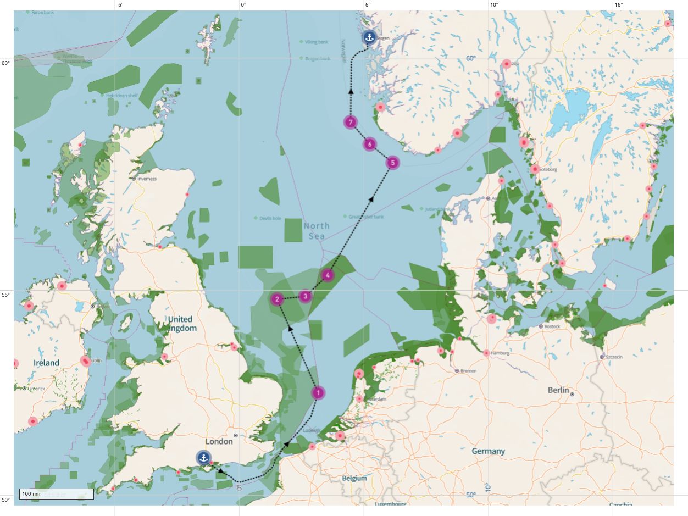
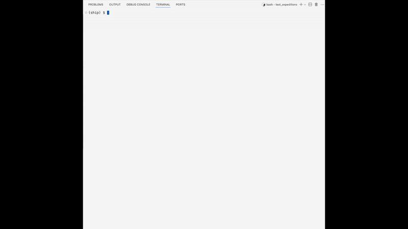
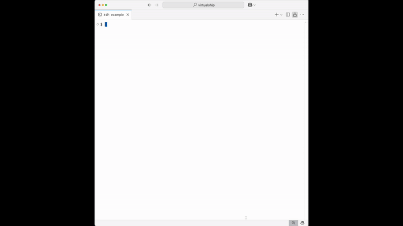

# VirtualShip Quickstart Guide 🚢

Welcome to this Quickstart to using VirtualShip. In this guide we will conduct a virtual expedition in the North Sea. Note, however, that you can plan your own expedition anywhere in the global ocean and conduct whatever set of measurements you wish!

This Quickstart is available as an instructional video below, or you can continue with the step-by-step guide.

```{caution}
Please note the video below may show output from an earlier version of VirtualShip, as the codebase is in active development. The instructions in the video are still generally applicable for the current version. However, for the most up-to-date instructions, please follow the text in this Quickstart guide.
```

<iframe width="720" height="400" src="https://www.youtube.com/embed/yymj5fImnRc?si=04Nt3YEhGRMBcEBI" title="YouTube video player" frameborder="0" allow="accelerometer; autoplay; clipboard-write; encrypted-media; gyroscope; picture-in-picture; web-share" referrerpolicy="strict-origin-when-cross-origin" allowfullscreen></iframe>

---

This guide is intended to give a basic overview of how to plan, initialise and execute a virtual expedition. Data post-processing, analysis and visualisation advice is provided in other sections of the documentation (see [Results](#results) section).

## 1) Expedition route planning

```{note}
This section describes the _custom_ expedition route planning procedure. There is also an option to proceed without your own route and you can instead use an example route, schedule and selection of measurements (see [Expedition initialisation](#expedition-initialisation) for more details).
```

### NIOZ MFP tool

The first step is to plan the expedition route. This can be created with the online [ NIOZ MFP tool](https://nioz.marinefacilitiesplanning.com/cruiselocationplanning#). Documentation on how to use the website can be found [here](https://surfdrive.surf.nl/files/index.php/s/84TFmsAAzcSD56F). Alternatively, you can watch this [video](https://www.youtube.com/watch?v=yIpYX2xCvsM&list=PLE-LzO7kk1gLM74U4PLDh8RywYXmZcloz&ab_channel=VirtualShipClassroom), which runs through how to use the MFP tool.

Below is a screenshot of a North Sea expedition. This example expedition departs from Southampton, UK; conducts measurements at one sampling site in the southern North Sea, three in the Dogger Bank region and a further three around the Norwegian Trench before ending in Bergen, Norway.

Feel free to design your expedition as you wish! There is no need to copy these sampling sites in your own expeditions.



### Export the coordinates

Once you have finalised your MFP expedition route, select "Export" on the right hand side of the window --> "Export Coordinates" --> "DD". This will download your coordinates as an .xlsx (Excel) file, which we will later feed into the VirtualShip protocol to initialise the expedition.

## 2) Expedition initialisation

```{note}
VirtualShip is a command line interface (CLI) based tool. From this point on in the Quickstart we will be working predominantly via the command line in the Terminal. If you are unfamiliar with what a CLI is, see [here](https://www.w3schools.com/whatis/whatis_cli.asp) for more information.
```

You should now navigate to where you would like your expedition to be run on your (virtual) machine (i.e. `cd path/to/expedition/dir/`). Then run the following command in your CLI:

```
virtualship init EXPEDITION_NAME --from-mfp CoordinatesExport.xlsx
```

```{tip}
The `CoordinatesExport.xlsx` in the `virtualship init` command refers to the .xlsx file exported from MFP. Replace the filename with the name of your exported .xlsx file (and make sure to move it from the Downloads to the folder/directory in which you are running the expedition).
```

This will create a folder/directory called `EXPEDITION_NAME` with a single file: `expedition.yaml` containing details on the ship and instrument configurations, as well as the expedition schedule based on the sampling site coordinates that you specified in your MFP export. The `--from-mfp` flag indicates that the exported coordinates will be used.

```{note}
For advanced users: it is also possible to run the expedition initialisation step without an MFP .xlsx export file. In this case you should simply run `virtualship init EXPEDITION_NAME` in the CLI. This will write an example `expedition.yaml` file in the `EXPEDITION_NAME` folder/directory. This file contains example waypoints, timings, instrument selections, and ship configuration, but can be edited or propagated through the rest of the workflow unedited to run a sample expedition.
```

## 3) Expedition scheduling & configuration

```{important}
This section describes the process of finalising the expedition schedule and instrument selection using the `virtualship plan` application. This is the recommended way for most users but when expeditions become larger with many waypoints, it can become cumbersome to use the planning tool (note, using VirtualShip in a remote terminal / cloud-based environment can also introduce lag in the user-interface). **In this case, you may prefer to edit the `expedition.yaml` file directly (see [here](./tutorials/working_with_expedition_yaml.md) for more details on how to do so)**.
```

The next step is to finalise the expedition schedule plan, including setting times and instrument selection choices for each waypoint, as well as configuring the ship (such as its speed and underway measurement instruments). The easiest way to do so is to use the bespoke VirtualShip planning tool via the following command:

```
virtualship plan EXPEDITION_NAME
```

The planning tool should look something like this and offers an intuitive way to make your selections:



### Ship speed

In the planning tool, under _Ship Config Editor_ > _Ship Speed & Onboard Measurements_, there is an option to change the ship speed. In most cases it is best to leave this as the default 10 knots value.

### Underway measurements

VirtualShip is capable of taking underway temperature and salinity measurements, as well as onboard ADCP measurements, as the ship sails across the length of the expedition (see [here](https://virtualship.readthedocs.io/en/latest/user-guide/assignments/Research_proposal_intro.html#Underway-Data) for more detail). These underway measurements can be switched on/off under _Ship Config Editor_ > _Ship Speed & Onboard Measurements_ as well.

For the underway ADCP, there is a choice of using the 38 kHz OceanObserver or the 300 kHz SeaSeven version (see [here](https://virtualship.readthedocs.io/en/latest/user-guide/assignments/Research_proposal_intro.html#ADCP) for more detail on the two ADCP types).

### Instrument/sensor configuration

The most important instrument configuration setting to consider is the list of **sensors** for each instrument, which controls what type of measurements/variables the instrument records in the simulation and therefore what output data you will receive for each instrument.

Sensor lists can be configured for each instrument under _Ship Config Editor_ > _Instrument Configurations_. For example, for the CTD instrument, you can specify which sensors to include in the simulation (e.g., `TEMPERATURE`, `SALINITY`, `OXYGEN`, etc.) by toggling the respective switches on or off.

```{note}
Sensor choices are only relevant for the instruments you plan to deploy as [underway measurements](#underway-measurements) or at waypoints across your expedition schedule [(see below)](#instrument-selection). For example, if you do not select to deploy a CTD at any of your waypoints, the CTD sensor choices will not affect any output data.
```

```{tip}
See [here](../documentation/full_sensor_list.md) for more information on the sensors available for each instrument.
```

There are other instrument configurations settings that can be adjusted in the editor as well (e.g. `max_depth` for the CTD), but these are more advanced and in most cases do not need to be changed from the default values.

### Waypoint datetimes

<!-- TODO: change this to a reference to `Run the data` instead of `Fetch the data` and talk a bit about data in the run step -->

```{note}
VirtualShip supports simulating experiments in the years 1993 through to the present day (and up to two weeks in the future) by leveraging the suite of products available Copernicus Marine Data Store (see [Run the expedition](#run-the-expedition)). The data access is automated based on the time period selected in the schedule. Different periods will rely on different products from the Copernicus Marine catalogue (see [Documentation](documentation/copernicus_products.md)).
```

You will need to enter dates and times for each of the sampling stations/waypoints selected in the MFP route planning stage. This can be done under _Schedule Editor_ > _Waypoints & Instrument Selection_ in the planning tool.

Each waypoint has its own sub-panel for parameter inputs (click on it to expand the selection options). Here, the time for each waypoint can be inputted. There is also an option to adjust the latitude/longitude coordinates and you can add or remove waypoints.

```{note}
It is important to ensure that the timings for each station are realistic. There must be enough time for the ship to travel to each site at a realistic speed (~ 10 knots). The expedition schedule (and the ship's configuration) will be automatically verified when you press _Save Changes_ in the planning tool.
```

```{tip}
The MFP route planning tool will give estimated durations of sailing between sites, usually at an assumed 10 knots sailing speed. This can be useful to refer back to when planning the expedition timings and entering these into the `virtualship plan` tool.
```

### Instrument selection

You should now consider which measurements are to be taken at each sampling site, and therefore which instruments need to be selected in the planning tool.

```{tip}
Click [here](https://virtualship.readthedocs.io/en/latest/user-guide/assignments/Research_proposal_intro.html#Measurement-Options) for more information on what instrument options are available in VirtualShip, and a brief introduction to each.
```

You can make instrument selections for each waypoint in the same sub-panels as the [waypoint time](#waypoint-datetimes) selection by simply switching each on or off. Multiple instruments are allowed at each waypoint.

### Save changes

When you are happy with your ship configuration and schedule plan, press _Save Changes_.

```{note}
On pressing _Save Changes_ the tool will check the selections are valid (for example that the ship will be able to reach each waypoint in time). If they are, the changes will be saved to the `expedition.yaml` file, ready for the next steps. If your selections are invalid you should be provided with information on how to fix them.
```

## 4) Run the expedition

You are now ready to run your virtual expedition! This stage will simulate the measurements taken by the instruments you selected at each waypoint in your expedition schedule, using input data sourced from the [Copernicus Marine Data Store](https://data.marine.copernicus.eu/products).

You will need to register for Copernicus Marine Service account (see [here](https://data.marine.copernicus.eu/register)), but the data access in VirtualShip will be automated.

You can run your expedition simulation using the command:

```
virtualship run EXPEDITION_NAME
```

If this is your first time running VirtualShip, you will be prompted to enter your own Copernicus Marine Data Store credentials (these will be saved automatically for future use).

Your command line output should look something like this...



Small simulations (e.g. small space-time domains and fewer instrument deployments) will be relatively fast. For large, complex expeditions, it _could_ take up to an hour to simulate the measurements depending on your choices. Waiting for simulation is a great time to practice your level of patience. A skill much needed in oceanographic fieldwork ;-)

Why not browse through previous real-life [blogs and expedition reports](https://virtualship.readthedocs.io/en/latest/user-guide/assignments/Sail_the_ship.html#Reporting) in the meantime?!

#### Encountering 'real-life challenges' during the expediton (configurable)

By default, VirtualShip will have a smooth sailing experience, but to enhance authenticity, VirtualShip can be configured to encounter 'real-life challenges' during the expedition. These are simulated 'problems' that can occur during real-life oceanographic expeditions (e.g. instrument and/or equipment failure, logistical challenges etc.) and may require your intervention to ensure your expedition schedule can continue.

The real-life challenges can be configured by setting the difficulty level (`--difficulty-level`) parameter in the `virtualship run` command. It can be set to "easy" (no problems, _default_), "medium" or "hard" (e.g. `virtualship run EXPEDITION_NAME --difficulty-level medium`).

```{tip}
For maximum authenticity, you can set `--difficulty-level hard`, which will scale the number of problems encountered by the complexity of your expedition (longer duration, more waypoints, more instruments will lead to more problems). `--difficulty-level` medium will limit the number of problems to a maximum of 2, regardless of the expedition complexity.
```

#### Using pre-downloaded data (optional)

By default, VirtualShip will stream data 'on-the-fly' from the Copernicus Marine Data Store, meaning no prior data download is necessary. However, if you prefer to use pre-downloaded data instead (e.g. due to limited internet connection or wanting to use different input data) you can do so by running `virtualship run EXPEDITION_NAME --from-data <PATH_TO_DATA_DIR>`.

Enter `virtualship run --help` to see the full description of the `--from-data` flag and its usage.

See the relevant [documentation](https://virtualship.readthedocs.io/en/latest/user-guide/documentation/pre_download_data.html#) for more detail on how to prepare data for offline use.

## 5) Results

Upon successfully completing the simulation, results from the expedition will be stored in the `EXPEDITION_NAME/results` directory, written in `.parquet` [format](https://parquet.apache.org/).

From here you can carry on your analysis (offline). We encourage you to use [Parcels](https://Parcels-code.org/) (i.e. `parcels.read_particlefile()`) to read in VirtualShip output files, and tools such as [Polars](https://www.pola.rs/) and/or [Pandas](https://pandas.pydata.org/) for further data analysis.

We also provide various [VirtualShip tutorials](https://virtualship.readthedocs.io/en/latest/user-guide/tutorials/index.html) with further examples of how to visualise data recorded by the VirtualShip instruments.
