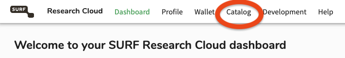
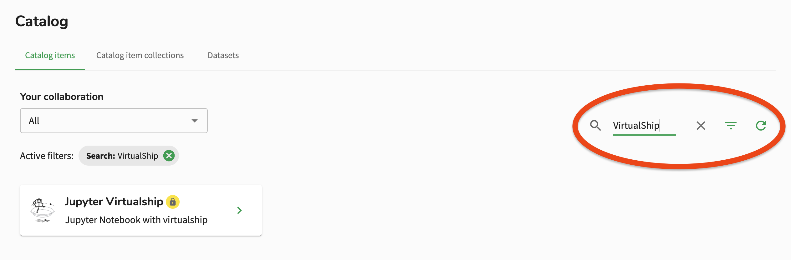
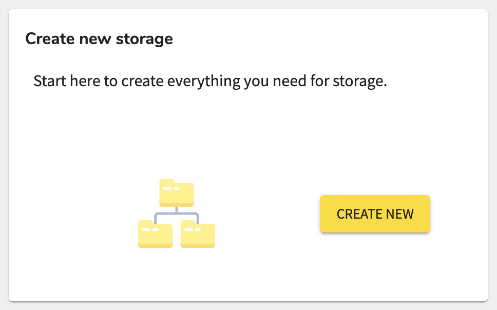
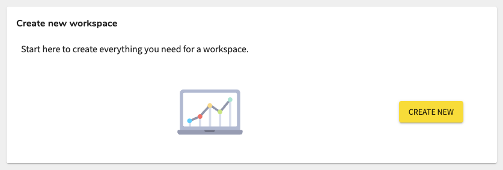
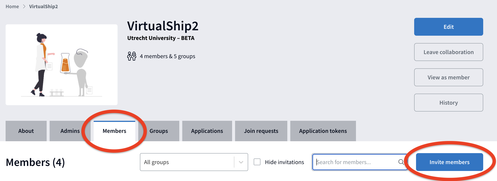

# Educator guide: Set up the SURF Research Cloud (RC)

```{note}
For this guide, we will assume that you are the course convenor, already have access to the SURF Research Cloud and have credits available.
```

```{tip}
For general information on how to use the SURF Research Cloud, please refer to their [documentation](https://servicedesk.surf.nl/wiki/spaces/WIKI/pages/9798172/SURF+Research+Cloud).
```

In this documentation, we will primarily be working from the SURF Research Cloud dashboard (or "portal") which is available at: [https://portal.live.surfresearchcloud.nl/dashboard/workspaces](https://portal.live.surfresearchcloud.nl/dashboard/workspaces). You can log in to the dashboard using your institutional credentials.

## The VirtualShip Catalog item

The VirtualShip Team has created a pre-configured "Catalog item" on the SURF Research Cloud that contains all the necessary software and dependencies for running VirtualShip. This includes a JupyterLab environment, the VirtualShip software itself, and a selection of useful post-processing packages (`xarray`, `matplotlib`, `cartopy`, `plotly` etc.).

This means you can deploy VirtualShip on a SURF Research Cloud workspace 'out of the box'. This guide will go through the steps you'll need to take to get access to this pre-configured environment and to set up a workspace for your students.

First please log in to the SURF Research Cloud [dashboard/portal](https://portal.live.surfresearchcloud.nl/dashboard/workspaces) and navigate to the "Catalog" heading (Figure 1).


_Figure 1. Navigating to the Catalogue via the SURF Research Cloud dashboard (screenshot)._

You should see a wide selection of available catalogue items. You can search for the VirtualShip catalogue item by typing "VirtualShip" in the search bar (Figure 2). When you find the VirtualShip catalogue item, click on it to view more details and to **request access**. The VirtualShip Team will then review your request and grant accesss.


_Figure 2. The pre-configured VirtualShip Catalogue item (screenshot)._

## Arranging storage space

```{important}
The persistent storage space is different from the `home` directory of the workspace, which you first enter when launching the workspace. `home` is not persistent and its contents will be lost when the workspace is stopped!
```

It is important to have persistent `storage` associated with your workspace. This is where students should base their work and save any expedition, configuration or output files. You can request a persistent storage space via the SURF Research Cloud dashboard (Figure 3).


_Figure 3. Creating persistent storage space via the SURF Research Cloud dashboard (screenshot)._

As a rough rule of thumb, a 50GB storage space should be sufficient for a classroom activity, as the VirtualShip output files are generally not very large.

```{tip}
Once attached to the workspace you create (see the next section), the storage space (with the name you chose during set up) should be available under the `/data` directory in the workspace. Typical VirtualShip workflows will then get (groups of) students to make their own subdirectory in `/data/{storage-name}` for their expeditions.
```

## Creating a new workspace

Next, return to the main dashboard and click to create a new `workspace` (Figure 4).


_Figure 4. Creating a new workspace via the SURF Research Cloud dashboard (screenshot)._

From here, you can run through the steps to create a new workspace. You will be prompted to select a catalogue item, and you should select the VirtualShip catalogue item that you requested access to in the previous step. You will probably have to use the search bar again and it should be visible once you have been granted access.

You should also attach the `storage` you created in the previous step. This ensures persistent storage for students across sessions. You can also select the size of the workspace (CPU, RAM, storage) and the duration for which it will be available.

```{tip}
When it comes to selecting a "Cloud Provider" (and if you have multiple choices), we recommend simply sticking to the SURF HPC Cloud for reduced credit consumption.

Generally, a classroom VirtualShip activity will not require large amounts of resource, so you can also usually select a smaller workspace size (e.g. 2 or 4 CPU, 16 GB RAM). Choosing a higher CPU count will use up more credits!

You can always "pause" a workspace when it is not in use, which will reduce credit consumption, and then "resume" it when needed again.
```

## Inviting students to the workspace

Once your workspace is set up, you can invite students to join it. This is facilitated through the separate [SURF Research Access Management (SRAM)](https://sram.surf.nl/collaborations-overview) platform.

After logging in, select to your collaboration and, as an admin, you should be able to navigate to the "Members" tab and invite new members to the collaboration (Figure 5).


_Figure 5. Inviting students to the collaboration via SRAM (screenshot)._

You will need to provide the email addresses of your students and they will receive an invitation to join the collaboration. Once they have accepted the invitation, they should be able to log in to the SURF Research Cloud via their institutional credentials and see/access the workspace you created before.

## Student access to the workspace

Please refer back to the main train-the-teacher [documentation](train_the_teacher.md/#student-access-to-the-workspace) for information on how students can access the workspace and perform the final steps to use the VirtualShip software.

## Updating the workspace

The VirtualShip Team will be responsible for maintaining and keeping the catalogue item up to date. However, if you ever come across a problem with the software (e.g. suspected bugs) or you would like to request a new feature which should be added to the version in the catalogue item, please get in touch with the Team via our [GitHub issue tracker](https://github.com/Parcels-code/virtualship/issues) or by email: [virtualship@uu.nl](mailto:virtualship@uu.nl). We are open to requests and will try to accommodate them as quickly as possible!

If the software has been updated when your workspace is already active, you will need to update your own version in the workspace to use the new version.

You can do so by running the following commands in the Terminal in your launched workspace (see the Note block below though as you will need to replace `{branch-name}` with the name of the branch you want to install):

```bash
# activiate the VirtualShip environment
conda activate virtualship

# this will install the updated version of VirtualShip
sudo /etc/miniconda/envs/virtualship/bin/pip install --upgrade git+https://github.com/Parcels-code/virtualship@{branch-name}
```

After a successful update, you should restart the workspace to ensure that the new version is being used. Students should then also have access to the updated version of VirtualShip.

```{note}
The specific branch name to use (`{branch-name}`) will depend on the version of VirtualShip you want to install. For example, if we have coordinated to add a new feature which is not yet in the `main` branch, we may ask you to install from a specific branch. If you are unsure which branch to use, please [contact](train_the_teacher.md/#feedback-support) the VirtualShip Team.
```

```{important}
This instruction involves the use of `sudo` to install the updated version of VirtualShip, so this should only be done by the course convenor (or someone with admin privileges).
```
